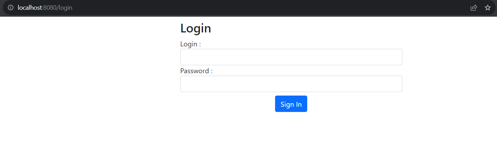
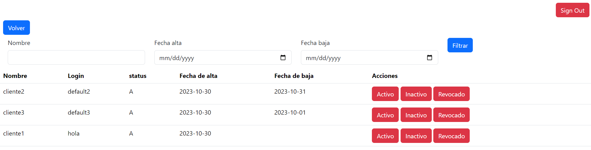
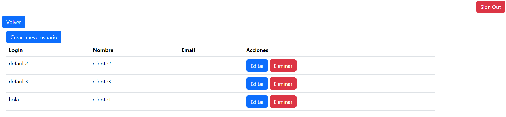
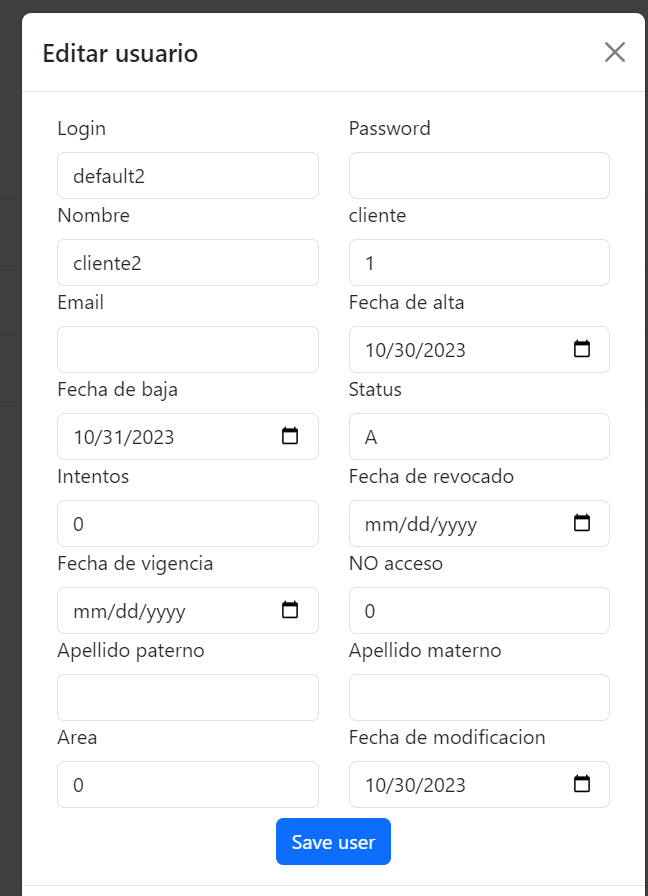

# Examen AdeA java-spring
Aplicacion creada con Maven, java 17
## Base de datos
Creada con MySQL

url=jdbc:mysql://localhost:3306/adea_db

username=root

password=password
## Usuarios creados automaticamente
| login    | password  |
|----------|:---------:|
| default1 | password1 |
| default2 | password2 |
| default3 | password3 |

## Login
Todas las vistas estan protegidas por sistema de autenticacion, por lo que para ingresar a cualquier seccion de la aplicacion primero es necesario realizar el login.

## Tablero de usuarios
El formulario de busqueda debe coincidir exactamente con el usuario: es decir la busqueda dara resultados con el nombre exactamente igual al de la busqueda  

Los diferentes botones de acciones cambian el status del usuario.

## Gestion usuarios
Sistema CRUD para usuarios, cuando un usuario edite su informacion su password no aparecera, de modo que si no se cambia se conservara la misma contraseña, sin embargo si se modifica, se guardara la nueva encriptada en la base de datos

